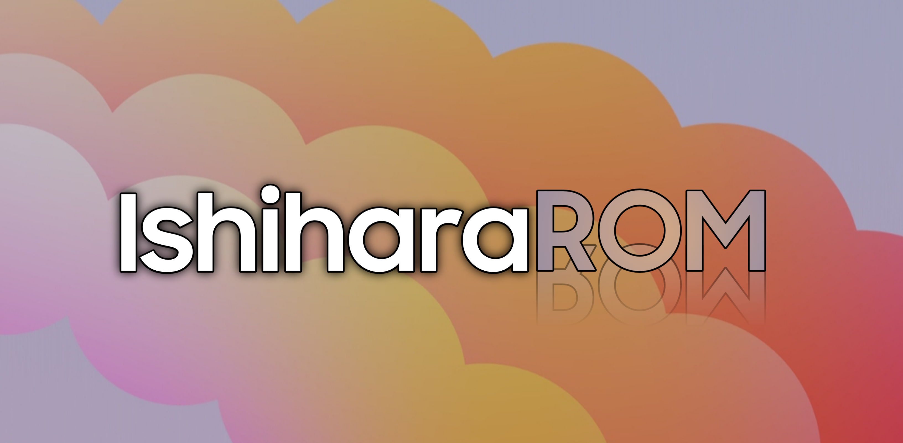

# Ishihara0xn-ROM v6.1.1

  
*A full Samsung firmware port for Galaxy S20/S20+/Ultra and Note20 series with enhanced features and customization*

## 📌 Key Features
- Based on latest Samsung OneUI firmware
- Full device-specific porting
- Customizable feature flags
- Support for multiple device variants

## ⚠️ Requirements
- **Unlocked Bootloader** (Will trip Knox)
- Snapdragon Variant
- Minimum 50GB free storage
- WSL Required

## 🛠️ Build Instructions

### 1. Initial Setup

git clone https://github.com/ishihara0xn/Ishihara0xn-ROM
cd Ishihara0xn-ROM

### 2. Configuration
Edit conf.txt with your parameters:
MODEL , REGION , IMEI , KITCHEN_PATH etc

